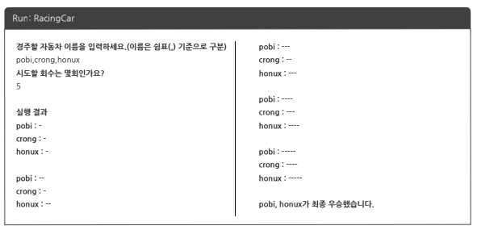

# 자동차 경주 게임

## 기능 요구사항

### UI / View
#### Input
* 경주할 자동차는 쉼표(,)로 구분된 자동차 이름으로 입력 받는다. 
* 자동차의 이름은 5자 이하이다.
* 사용자는 몇 번의 이동을 할 것인지 입력한다.
#### Output
* 실행 결과는 자동차 이름과 같이 전진한 거리를 출력한다.
* 자동차 경주 게임을 완료한 후 누가 우승했는지를 알려준다.
#### 프로그램 실행 결과 화면

### 게임 로직
* 주어진 횟수 동안 n대의 자동차는 전진 또는 멈출 수 있다.
* 전진하는 조건은 0에서 9 사이에서 random 값을 구한 후 random 값이 4 이상일 경우 전진하고, 3 이하의 값이면 멈춘다.
* 우승자는 한 명 이상일 수 있다.

## 구현할 기능 목록
* MVC-model로 프로젝트를 구성한다.
* 자동차가 전진하는 기능을 TDD로 구현한다.
* 자동차가 random한 조건으로 전진하는 기능을 구현한다.
* 우승자를 판별하는 기능을 TDD로 구현한다.
* 유저의 input을 validate하는 기능을 TDD로 구현한다.
* 유저의 input을 console로 입력 받는 기능을 구현한다.
* 자동차 게임의 결과를 console로 출력하는 기능을 구현한다.
* 게임의 전체적 로직을 담당하는 controller를 구현한다.